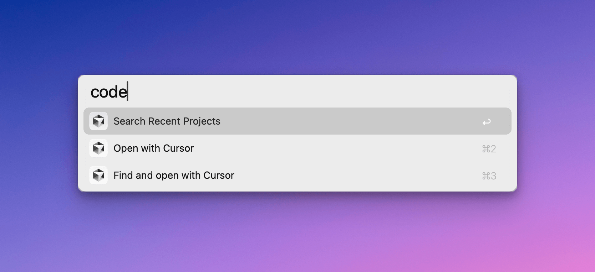

# alfred-open-with-cursor

Alfred workflow to open recent project in cursor.

## Usage

Install workflow and enter following keywords:

- type `codes`: Search Recent Project in Cursor
- type `codef`: Find and open with Cursor
- type `code`: Open currenct folder with Cursor

## Acknowledgements

Fork from [alfred-open-with-vscode-workflow](https://github.com/alexchantastic/alfred-open-with-vscode-workflow)

Inspired by Raycast Extension [Cursor](https://www.raycast.com/degouville/cursor-recent-projects) 

Developed with Cursor AI.